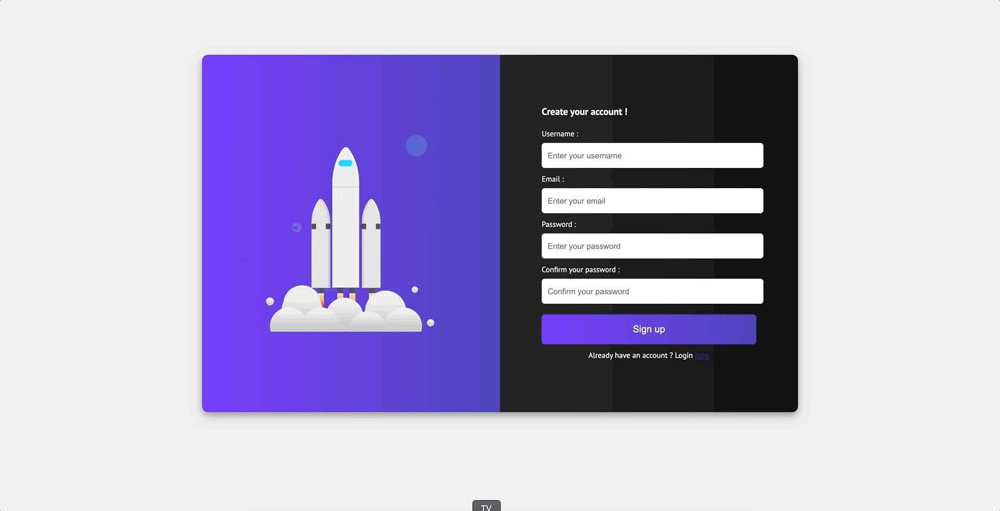
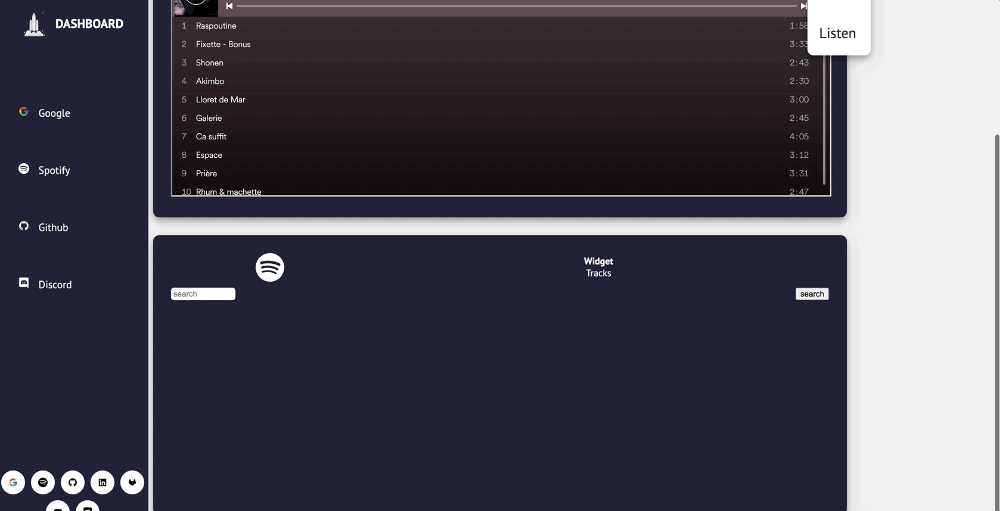
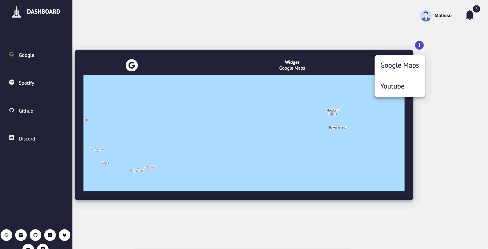

[](https://github.com/EpitechPromo2024/B-DEV-500-MPL-5-1-dashboard-clement.bolin/actions/workflows/ci-api.yml)
[](https://github.com/EpitechPromo2024/B-DEV-500-MPL-5-1-dashboard-clement.bolin/actions/workflows/ci-client.yml)

<div style='
  display: flex;
  justify-content: center;
  flex-direction: row;
  flex-wrap: wrap;
'>
  <p align="center">
    
    
    
  </p>
</div>

# Dashboard

📖 this project is a project of study Epitech, the objective of this one is to realize a dashboard, where you can instantiate different widget, connect you etc...
We had only 8 days of work to realize this project, it is for these reasons that this one is not perfect and that you could meet bugs, do not hesitate to signal them in the issues.

🚀 The technologies used for those below:
Nx / docker / docker-compose / Nx / Nest / TS / React

## How to build app:

before launching the application add the information in the following `.env`. [doc](./docs/Oauth2.md)

#### With Docker:

```sh
docker build -t dashboard:nx-base .
```

```sh
docker-compose up
```

#### Without Docker:

```sh
yarn install && yarn run app:start
```
