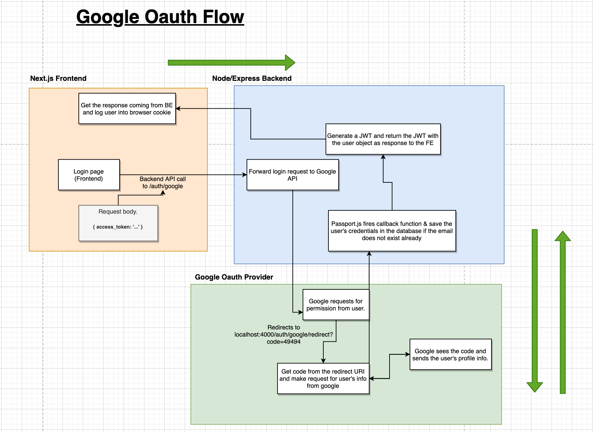

# Notes

### Auth

- One local auth
- Anonymous account
- Oauth (Google, Twitter, Facebook, etc...)

**model:**


### Services

Each Service will offer Widgets. Widget instances can be added to the Dashboard after being configured.

- [ ] Add a new Widget instance by asking the user to:
  - [ ] Select a Widget
  - [ ] Configure the previously selected Widget
  - [ ] Enter the preconfigured refresh rate of the Widget
  - [ ] Add the Widget on the Dashboard
- [ ] Reconfigure a Widget instance present on the Dashboard
- [ ] Move a Widget instance present on the Dashboard
- [ ] Delete a Widget instance present on the Dashboard

### Timers

This essential element of the application aims to refresh the information presented by the Widget instances present on the Dashboard.

To do this, for each Widget instances present on the Dashboard will communicate to Timer its refresh rate so that it triggers the necessary updates at the right time.

### Server

Must be running on port 8080 and have a ping route who is ```http://localhost:8080/about.json``` and it should return a json response like the example bellow:

```json
{
   " client ":{
      " host ":"10.101.53.35"
   },
   " server ":{
      " current_time ":1531680780,
      " services ":[
         {
            " name ":" weather ",
            " widgets ":[
               {
                  " name ":" city_temperature ",
                  " description ":" Display temperature for a city ",
                  " params ":[
                     {
                        " name ":" city ",
                        " type ":" string "
                     }
                  ]
               }
            ]
         },
         {
            " name ":" rss ",
            " widgets ":[
               {
                  " name ":" article_list ",
                  " description ":" Displaying the list of the last articles ",
                  " params ":[
                     {
                        " name ":" link ",
                        " type ":" string "
                     },
                     {
                        " name ":" number ",
                        " type ":" integer "
                     }
                  ]
               }
            ]
         }
      ]
   }
}
```

**json configuration:**
- ```client.host``` indicates the IP address of the client performing the HTTP request
-  ```server.current_time``` indicates the server time in the Epoch Unix Time Stamp format
-  ```server.services``` indicates the list of Services supported by the server
-  ```server.services[].name``` indicates the name of the Service
-  ```server.services[].widgets``` indicates the list of Widgets supported by this Service
-  ```server.services[].widgets[].name``` indicates the identifier of this Widget
-  ```server.services[].widgets[].params``` indicates the list of parameters to configure this Widget
-  ```server.services[].widgets[].params[].name``` indicates the identifier of this parameter
-  ```server.services[].widgets[].params[].type``` indicates the type of this parameter. Supported types are: integer, string

### Architecture

```
myorg/
├── apps/
├── libs/
├── tools/
├── workspace.json
├── nx.json
├── package.json
└── tsconfig.base.json
```

```/apps/``` contains the application projects. This is the main entry point for a runnable application. We recommend keeping applications as light-weight as possible, with all the heavy lifting being done by libraries that are imported by each application.

```/libs/``` contains the library projects. There are many kinds of libraries, and each library defines its own external API so that boundaries between libraries remain clear.

```/tools/``` contains scripts that act on your code base. This could be database scripts, custom executors, or workspace generators.

```/workspace.json``` lists every project in your workspace.

```/nx.json```configures the Nx CLI itself. It tells Nx what needs to be cached, how to run tasks etc.

```/tsconfig.base.json``` sets up the global TypeScript settings and creates aliases for each library to aid when creating TS/JS imports.